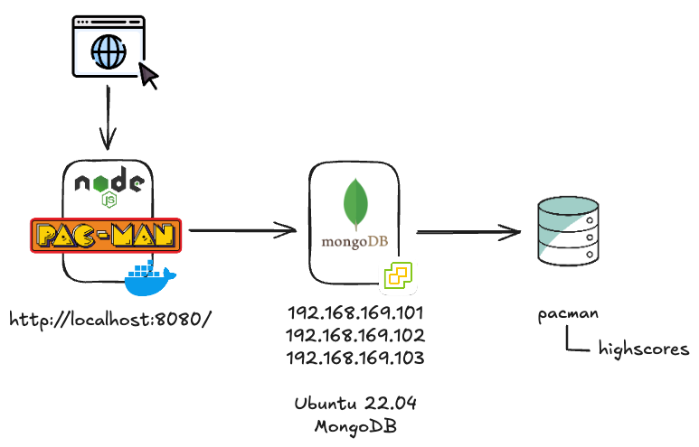

# Pac-Man
Pac-Man Demo App for use with external MongoDB replicaset 

You will find (bad of me I know) the config.js has some hard coded mongodb connection values, if you are looking to connect this to your environment then please change here. 

This code base originates from demos created for a demo in Kubernetes so there maybe warnings and errors related to this being ran inside a Kubernetes cluster. 

Code is for demo purposes only 

This demo consists of 3 virtual machines running in a vSphere environment but could be anywhere on a network, and this application running in a docker container. I provisioned the MongoDB replicaset using terraform and ansible and will share that code in another repository. 



## Development instructions

#### Getting started

Build the image locally once, to check everything is working fine
```
./scripts/build.sh
```

Once inside the build environment, you can use
```
npm install
```
to update/install newer versions of the Node.js packages used by the app.

If you don't see any error, you should proceed with starting the development environment
```
./scripts/dev.sh
```

You should be inside one container, on the same network as a running MongoDB database server.
```
npm run dev
```

You should see your Node.js server logs, keep the server running.
Open a new browser windows, navigate to `http://localhost:8000/`, you should see the Pac-Man game.

## Create Application Artifacts

### Docker Container Image

The [Dockerfile](Dockerfile) performs the following steps:

1. It is based on the latest Node.js.
1. It then ADD the Pac-Man game into the configured application directory.
1. Exposes port 8080 for the web server.
1. Starts the Node.js application using `npm start`.

To build the image in preparation for hosting it to your own repo, run:

```
docker build -t <registry>/<user>/pacman .
```

You can test the image by running:

```
docker run -p 8000:8080 <registry>/<user>/pacman
```
Note: You will need a working MongoDB backend. Look at [scripts/dev.sh] to understand how you can setup a local one on your machine using an insecure password, for development purposes only.
